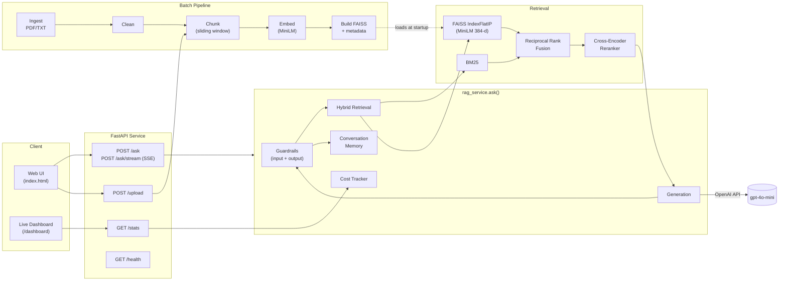

# Cloud-Native RAG — Production-Grade Retrieval-Augmented Generation

A full-stack, evaluable, observable RAG system for document question answering.

Not a chatbot demo. This is end-to-end ML engineering: batch ingestion, hybrid retrieval (BM25 + FAISS + RRF + cross-encoder reranker), streaming generation with guardrails, conversational memory, cost tracking, a live metrics dashboard, a reproducible eval harness, a test suite, and Cloud Run deployment.

---

## Highlights

| Layer | Capability |
| --- | --- |
| **Retrieval** | Hybrid BM25 + FAISS, Reciprocal Rank Fusion, cross-encoder reranker |
| **Generation** | OpenAI gpt-4o-mini, SSE streaming, conversational memory, demo mode |
| **Safety** | Input/output guardrails (PII, prompt-injection, off-topic refusal) |
| **Observability** | In-memory cost tracker, `/stats` API, live `/dashboard` UI |
| **Evaluation** | Retrieval (precision@k, recall@k, MRR) + answer-quality (keyword coverage, relevance, context utilization) — no LLM judge required |
| **Quality** | 214 tests, type-checked Pydantic models, structured logging |
| **Deploy** | Multi-stage Dockerfile, non-root user, healthcheck, Cloud Build → Cloud Run |

---

## Architecture



**Request lifecycle** (`POST /ask`):

1. Input guardrail screens the question (PII, injection, off-topic refusal).
2. Conversation memory pulls prior turns for the `session_id`.
3. Hybrid retrieval: BM25 + FAISS run in parallel → RRF merges → cross-encoder reranks top-N.
4. LLM generates an answer over the reranked context.
5. Output guardrail screens the answer.
6. Cost tracker records tokens, latency, and dollar cost.
7. Response returns answer, sources, confidence, cost, and `session_id`.

---

## Project Structure

```
rag/
├── app/
│   ├── main.py                # FastAPI bootstrap, static mounts, /dashboard
│   ├── api.py                 # /ask, /ask/stream, /upload, /stats, /health
│   ├── rag_service.py         # Orchestrator (retrieval + generation + memory + guardrails + cost)
│   ├── retrieval.py           # Hybrid BM25 + FAISS + RRF + reranker
│   ├── generation.py          # OpenAI client with retry
│   ├── guardrails.py          # Input/output safety screens
│   ├── conversation_store.py  # In-memory session memory
│   ├── cost_tracker.py        # Thread-safe token/cost/latency aggregator
│   ├── eval_harness.py        # Reference-based eval metrics + evaluate()
│   ├── config.py              # Pydantic settings (SecretStr for keys)
│   └── static/
│       ├── index.html         # Chat UI with SSE streaming
│       └── dashboard.html     # Live metrics dashboard
│
├── pipeline/
│   ├── ingest_documents.py    # Read PDF/TXT with metadata
│   ├── clean_text.py          # Normalisation
│   ├── chunk_documents.py     # Sliding-window chunker
│   ├── generate_embeddings.py
│   ├── build_index.py         # Build & persist FAISS + metadata
│   ├── evaluate_rag.py        # Retrieval grid-search
│   └── run_eval.py            # Extended end-to-end eval CLI
│
├── evaluation/
│   ├── test_questions.json    # Gold Q/A set with expected_document + expected_keywords
│   ├── expected_sources.json
│   └── metrics.py             # Legacy retrieval-only metrics
│
├── tests/                     # 214 tests
├── vector_store/              # Built FAISS index + chunks_metadata.json
├── data/
│   ├── raw/                   # Drop PDF/TXT source documents here
│   └── processed/
├── Dockerfile                 # Multi-stage, non-root, healthcheck
├── cloudbuild.yaml            # CI: test → build → push → deploy
├── requirements.txt
└── .env.example
```

---

## Quick Start

### 1. Install

```powershell
python -m venv .venv
.\.venv\Scripts\Activate.ps1
pip install -r requirements.txt
```

### 2. Configure

```powershell
Copy-Item .env.example .env
# edit .env:
#   OPENAI_API_KEY=sk-...
#   OPENAI_MODEL=gpt-4o-mini
```

Without a key the service runs in **demo mode** — retrieval still works; generation returns a canned response. The full test suite passes in demo mode (no live API calls).

### 3. Build the index

```powershell
python -m pipeline.build_index
```

Outputs `vector_store/faiss_index.index` and `vector_store/chunks_metadata.json`.

### 4. Run the API

```powershell
uvicorn app.main:app --reload --port 8000
```

Open:
- Chat UI: <http://localhost:8000/>
- Live dashboard: <http://localhost:8000/dashboard>
- OpenAPI: <http://localhost:8000/docs>

### 5. Ask

```powershell
curl -X POST http://localhost:8000/ask `
  -H "Content-Type: application/json" `
  -d '{"question": "What is the refund policy?"}'
```

```json
{
  "answer": "Refunds are available within 30 days of purchase...",
  "sources": [
    { "document_name": "company_policies.txt", "chunk_id": "company_policies_002", "score": 0.91 }
  ],
  "confidence": "high",
  "retrieval_score": 0.91,
  "latency_ms": 1340,
  "model": "gpt-4o-mini",
  "prompt_tokens": 412,
  "completion_tokens": 75,
  "total_tokens": 487,
  "cost_usd": 0.000107,
  "session_id": "9b2f...",
  "guardrail_blocked": false
}
```

### 6. Streaming

```bash
curl -N -X POST http://localhost:8000/ask/stream \
  -H "Content-Type: application/json" \
  -d '{"question":"What is the refund policy?"}'
```

Server-Sent Events stream `token` frames followed by a final `done` frame with full metadata.

---

## Features by Phase

### Phase 1 — UX & Streaming
- **Conversation memory** — per-session multi-turn context, in-memory store
- **Document upload** — `POST /upload` accepts new PDFs/TXTs and re-indexes
- **SSE streaming** — incremental token delivery to the browser
- **Confidence badges** — high / medium / low computed from retrieval score
- **Sample mode** — opt-in canned questions for demo recordings

### Phase 2 — Retrieval Quality
- **Hybrid BM25 + FAISS** with Reciprocal Rank Fusion (`rank-bm25`)
- **Cross-encoder reranker** (`cross-encoder/ms-marco-MiniLM-L-6-v2`)
- **Guardrails** — PII redaction, prompt-injection patterns, refusal policy
- **Cost tracking** — every code path records prompt/completion tokens, latency, $; thread-safe singleton

### Phase 3 — Operations
- **Live dashboard** (`/dashboard`) — auto-refreshing KPI cards + inline bar charts: uptime, request count, error rate, tokens, $ spend, p50/p95/p99 latency, model-mix breakdown
- **Extended eval harness** — see below

### Phase 4 — Documentation & Deployment
- Architecture diagram (above), runbook, eval methodology, Cloud Run deploy

---

## Running Tests

```powershell
python -m pytest tests/ -q
```

**214 tests** across modules: chunking, retrieval, hybrid retrieval, reranker, confidence, conversation store, streaming, upload, guardrails, cost tracker, dashboard, eval harness, API integration. The suite runs in demo mode → no API calls, no flake, ~15s end-to-end.

---

## Evaluation

Two harnesses, both reproducible without an LLM judge:

### Retrieval grid search

```powershell
python -m pipeline.evaluate_rag
```

Sweeps chunk size × overlap × top-k. Writes `evaluation/experiment_results.json` with per-config recall@k and MRR plus build time.

### End-to-end RAG eval

```powershell
python -m pipeline.run_eval --k 5 --out evaluation/results.json
```

Runs the **full pipeline** (guardrails + hybrid retrieval + reranker + generation) against [evaluation/test_questions.json](evaluation/test_questions.json). Reports:

| Metric | Meaning |
| --- | --- |
| **precision@k** | Fraction of top-K chunks from the gold document |
| **recall@k** | Gold document present in top-K? |
| **MRR** | Mean reciprocal rank of the first relevant chunk |
| **keyword_coverage** | Fraction of expected keywords present in the answer (faithfulness proxy) |
| **answer_relevance** | Jaccard token overlap between question and answer (off-topic detector) |
| **context_utilization** | Fraction of retrieved chunks actually referenced by the answer (hallucination signal) |
| **latency p50/p95/p99** | End-to-end response time distribution |
| **cost_usd** | Total + per-question dollar cost |

An optional `llm_judge_faithfulness` hook in [app/eval_harness.py](app/eval_harness.py) lets you bolt on an LLM-as-judge score when you want a second opinion — disabled by default to keep CI free and deterministic.

---

## Observability

`GET /stats?session_id=...` returns:

```json
{
  "global": {
    "uptime_s": 12345,
    "total_requests": 248,
    "total_errors":   2,
    "error_rate":     0.008,
    "total_prompt_tokens": 102341,
    "total_completion_tokens": 23415,
    "total_cost_usd": 0.0314,
    "model_calls": {"gpt-4o-mini": 246, "guardrail": 2},
    "latency_ms": {"p50": 880, "p95": 1820, "p99": 2410, "avg": 950, "max": 3120},
    "active_sessions": 3
  },
  "session": { "...same shape, scoped to one session_id..." }
}
```

The `/dashboard` page polls this every 3 seconds.

---

## Deployment

### Local Docker

```powershell
docker build -t rag:local .
docker run --rm -p 8000:8000 --env-file .env rag:local
```

Multi-stage build, non-root user, `HEALTHCHECK` against `/health`.

### Cloud Run

```powershell
gcloud builds submit --config cloudbuild.yaml
```

[cloudbuild.yaml](cloudbuild.yaml) runs the test suite, builds & pushes the image to Artifact Registry, then deploys to Cloud Run with the OpenAI key sourced from Secret Manager.

---

## Configuration

All settings come from `.env` via Pydantic `BaseSettings`:

| Var | Default | Purpose |
| --- | --- | --- |
| `OPENAI_API_KEY` | — | Required for live mode; empty → demo mode |
| `OPENAI_MODEL` | `gpt-4o-mini` | LLM for generation |
| `EMBEDDING_MODEL` | `sentence-transformers/all-MiniLM-L6-v2` | 384-d encoder |
| `RERANKER_MODEL` | `cross-encoder/ms-marco-MiniLM-L-6-v2` | Cross-encoder reranker |
| `CHUNK_SIZE` | `500` | Tokens per chunk |
| `CHUNK_OVERLAP` | `50` | Overlap between chunks |
| `TOP_K` | `5` | Chunks returned per query |
| `MAX_CONTEXT_CHARS` | `8000` | Context window cap |
| `ENABLE_GUARDRAILS` | `true` | Toggle safety screens |
| `ENABLE_RERANKER` | `true` | Toggle cross-encoder rerank |

---

## License

MIT.
